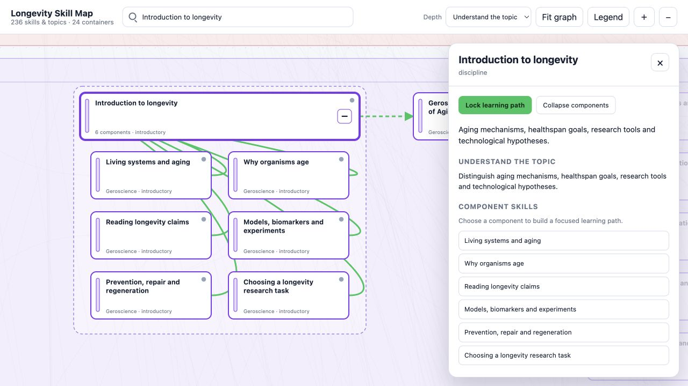

# Longevity Skill Map

An interactive map of the knowledge and practical skills needed for research on healthy life extension. Choose a skill or research direction, explore its prerequisites, and build a learning path from foundational concepts to practical tasks.

The current map contains **236 nodes, 868 relationships and 24 expandable containers**.



*The current application, showing the introductory learning modules and the selected topic's details.*

## What you can do

- **Explore longevity research.** Navigate biology, quantitative sciences, omics, AI, clinical research, genetic engineering and regenerative medicine in color-coded topic lanes.
- **Search for a skill.** Search titles, descriptions and research context, including components inside collapsed containers. Selecting a result brings the skill into view.
- **Expand broad disciplines.** Open containers such as gene therapy, drug discovery, brain rejuvenation or microscopy to explore their component skills.
- **Choose a mastery depth.** Switch between understanding a topic and working on practical tasks. Each skill includes learning outcomes for both depths and a practical task for assessing readiness.
- **Find learning materials.** Open courses, textbooks, tutorials and research resources from a skill's detail panel. Materials include chapter or lesson guidance where available.
- **Inspect dependencies.** Click a node to highlight its immediate neighbors and see prerequisites, skills it unlocks, and other applications. Hover provides a local preview without dimming the entire graph.
- **Lock a learning path.** Highlight the complete set of required prerequisites for a target at the chosen depth, then explore only those skills. Required components are revealed automatically; unrelated components stay outside the path.
- **Review research maturity.** Status markers and evidence notes distinguish foundational knowledge, established mechanisms, preclinical research, clinical platforms and speculative goals.

## Follow a learning path

1. Search for a target skill, or start with **Introduction to longevity**, built around Longevity Zero to One.
2. Choose a depth using the **Depth** selector:

   | Depth | Learning objective |
   |---|---|
   | **Understand the topic** | Explain the concepts, assumptions and limitations. |
   | **Work on tasks** | Apply relevant methods, analyze results and complete a scoped practical task. |

3. Select a node and click **Lock learning path** in its detail panel.
4. Explore the highlighted skills. The target remains fixed while you inspect prerequisites. **Explore required steps** lists the path in learning stages and shows the depth needed for each step.
5. Change the depth to recalculate the path for the same target, or click **Reset path** to return to unrestricted navigation.

A path includes all applicable required prerequisites, not just one shortest chain. Shared skills appear once. Selecting a component requires only the relevant parts of its parent discipline.

## Navigate the map

| Control | Action |
|---|---|
| Drag the background or scroll | Pan the map |
| Pinch, Ctrl + scroll, or **+ / −** | Zoom |
| **Fit graph** | Fit the full map or the locked path in view |
| **+ / −** on a container | Expand or collapse its components |
| **Legend** | Explain topic colors, status dots and edge styles |
| Arrow keys and Enter in search | Select a search result |
| Tab, then Enter or Space | Open a focused node |
| Escape | Dismiss search suggestions, details or the legend |

## Research coverage

The map connects school-level foundations to molecular and cellular aging, biomarkers, senescence, epigenetic rejuvenation, immune and brain aging, tissue and organ replacement, gene delivery, drug discovery and combination strategies.

It also covers organismal function and healthspan, organ-specific aging, human population studies, adult reproductive aging, extracellular aggregates, sleep, exercise and nutrition research. Reusable methods include applied statistics, epigenomics, cellular-aging measurements, tissue and brain analysis, omics processing and biological-product development.

For the dependency model and mastery-depth semantics, see the [graph documentation](graph/README.md).

## Run locally

Use Python 3.12 or newer:

```bash
python3 -m venv .venv
source .venv/bin/activate
pip install -r requirements.txt
python app.py
```

Open [http://127.0.0.1:8000](http://127.0.0.1:8000).

The service exposes the graph, node details and depth-specific learning paths through a FastAPI API. Interactive API documentation is available at [http://127.0.0.1:8000/docs](http://127.0.0.1:8000/docs), and the health endpoint is [http://127.0.0.1:8000/health](http://127.0.0.1:8000/health).

## Validate and test

With the Python environment activated, run:

```bash
python scripts/validate_graph.py
python -m unittest discover -s tests -v
```

The graph validator checks references, hierarchy, metadata and prerequisite cycles. Application tests cover learning paths, mastery depths and API behavior.

For presentation and interaction tests, also install Node.js and run:

```bash
node --test tests/*.test.js
```
