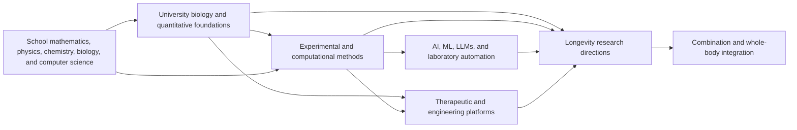

# Longevity skill graph

Machine-readable graph: [`longevity-skills.json`](./longevity-skills.json)  
Construction rules: [`../research/map-rules.md`](../research/map-rules.md)  
Direction review: [`../research/longevity-directions.md`](../research/longevity-directions.md)

The current version contains:

- 108 nodes;
- 291 edges;
- 26 research or integration targets;
- 6 school-level root nodes;
- 12 consolidated visual topic categories;
- 6 explicitly excluded or consolidated directions.

## Reading the graph

A `prerequisite` edge points from an earlier skill to the skill that depends on it. Multiple incoming edges with `strength: required` form an AND dependency: all of them are expected to be learned.

`recommended_before` improves a learning route but is not a strict requirement. `applied_in` shows where an existing skill is used and does not define learning order.

The first topic places a node in one of 12 horizontal spatial lanes. Within each lane, prerequisite depth determines the horizontal position: foundational nodes stay on the left and advanced dependent nodes move to the right. Each topic also has a fixed accent color: node borders use the saturated color while the containing lane uses a pale tint. The small dot retains a separate status color.



## Example routes

### Metabolic interventions

```text
school chemistry + school biology
  -> introductory biology + organic chemistry
  -> biochemistry
  -> metabolism/redox + physiology
  -> pharmacology
  -> metabolic interventions / nutrient sensing
```

### Aging clocks and multi-omics

```text
school mathematics + computer science + biology
  -> probability/statistics + Python + molecular biology
  -> bioinformatics + transcriptomics/genomics/proteomics
  -> multi-omics integration + machine learning
  -> biomarker validation + aging clocks
  -> biomarkers / aging clocks / multi-omics
```

### Partial reprogramming

```text
school biology + chemistry
  -> cell biology + molecular biology + genetics
  -> epigenetics + developmental/stem cell biology
  -> iPSC/organoids + gene-therapy delivery
  -> cancer biology + biomarker validation
  -> partial reprogramming / epigenetic rejuvenation
```

### Organ replacement

```text
school biology + chemistry + physics
  -> developmental biology + physiology + immunology + ECM biology
  -> cell culture + iPSC/organoids
  -> biomaterials/tissue engineering + transplantation
  -> bioprinting (recommended)
  -> cell/tissue/organ replacement
```

### AI-driven discovery

```text
school mathematics + computer science
  -> calculus + linear algebra + probability + Python
  -> machine learning -> deep learning
  -> biological foundation models / NLP / drug design / protein design
  + bioinformatics and domain biology
  + biomedical AI validation
  -> AI-driven longevity discovery
```

## Node schema

```json
{
  "id": "stable_snake_case_id",
  "title": "Node title",
  "summary": "A concise description of the skill and its purpose.",
  "kind": "skill",
  "topics": ["primary_topic", "secondary_topic"],
  "level": "graduate",
  "status": "foundational",
  "evidence_note": "Evidence limitations for a research direction.",
  "resources": [
    {
      "title": "A specific course or learning resource",
      "url": "https://example.org/resource",
      "type": "course",
      "provider": "Provider",
      "level": "graduate"
    }
  ]
}
```

## Edge schema

```json
{
  "from": "prerequisite_node",
  "to": "dependent_node",
  "type": "prerequisite",
  "strength": "required",
  "rationale": "Why the earlier node is needed."
}
```

## Validation

```bash
python3 scripts/validate_graph.py
```

The validator checks unique IDs, required fields and resources, valid references, edge types, cycles among strict prerequisites, reachability of every research direction from school-level foundations, and English-only graph content.

## Version 0.1 limitations

- The graph covers the major directions but does not decompose every skill into individual laboratory protocols.
- Nodes do not yet include formal assessments or estimated learning time.
- Some courses provide an overview and do not replace a degree program or supervised laboratory training.
- A direction's maturity status is not an individual medical recommendation.
- AND/OR prerequisite groups are not represented separately; all strict incoming prerequisites are treated as AND dependencies.
